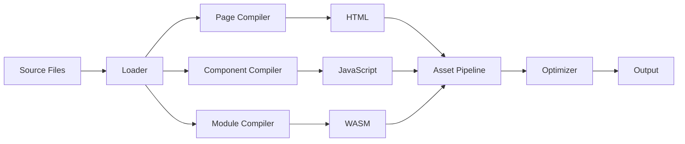

# Build System

The JAWT build system orchestrates the entire compilation and bundling process, transforming source files into production assets.

## Core Components

### Build Pipeline



### Key Features

1. **Dependency Graph**
   - Tracks dependencies between files
   - Determines optimal build order
   - Enables incremental builds

2. **Asset Pipeline**
   - Processes images, fonts, and other assets
   - Optimises file sizes
   - Generates appropriate content hashes for cache busting

3. **Code Splitting**
   - Automatically splits code into chunks
   - Supports lazy loading
   - Optimises initial load time

4. **Optimisation**
   - Minifies JavaScript and CSS
   - Tree-shakes unused code
   - Optimises WASM modules

## Configuration

Configuration is done through `jawt.config.json` in the project root:

```json
{
  "build": {
    "outDir": "dist",
    "assetsDir": "assets",
    "minify": true,
  },
  "server": {
    "port": 6500,
    "host": "localhost",
    "https": false,
    "open": true
  }
}
```

## Production Builds

Running `jawt build` performs the following steps:

1. Clean build directory
2. Compile all source files
3. Process and optimise assets
4. Generate production bundles
5. Generate build manifest

Output structure:
```
dist/
├── assets/
│   ├── js/
│   ├── css/
│   └── media/
├── index.html
└── wasm/
```

## Development Server

The development server (`internal/server`) provides:

- Hot Module Replacement (HMR)
- Fast refresh for components
- Error overlay
- API proxying
- HTTPS support (if enabled)

### Features

1. **Hot Module Replacement**
   - Updates modules in the browser without full page reload
   - Preserves application state

2. **Error Overlay**
   - Displays compilation errors in the browser
   - Clickable stack traces

3. **Asset Serving**
   - Serves static files
   - Handles history API fallback for SPA routing

4. **Middleware Support**
   - Custom middleware support
   - Proxy configuration for API requests

## Caching

The build system implements several caching strategies:

1. **File System Cache**
   - Caches compilation results between builds
   - Invalidated based on file content hashes

2. **Dependency Resolution Cache**
   - Caches resolved module paths
   - Speeds up subsequent builds

## Performance Optimisations

1. **Parallel Processing**
   - Compiles files in parallel where possible
   - Uses worker threads for CPU-intensive tasks

2. **Incremental Compilation**
   - Only rebuilds changed files
   - Skips unchanged modules

3. **Memory Management**
   - Clears caches when not needed
   - Implements memory limits for large projects
