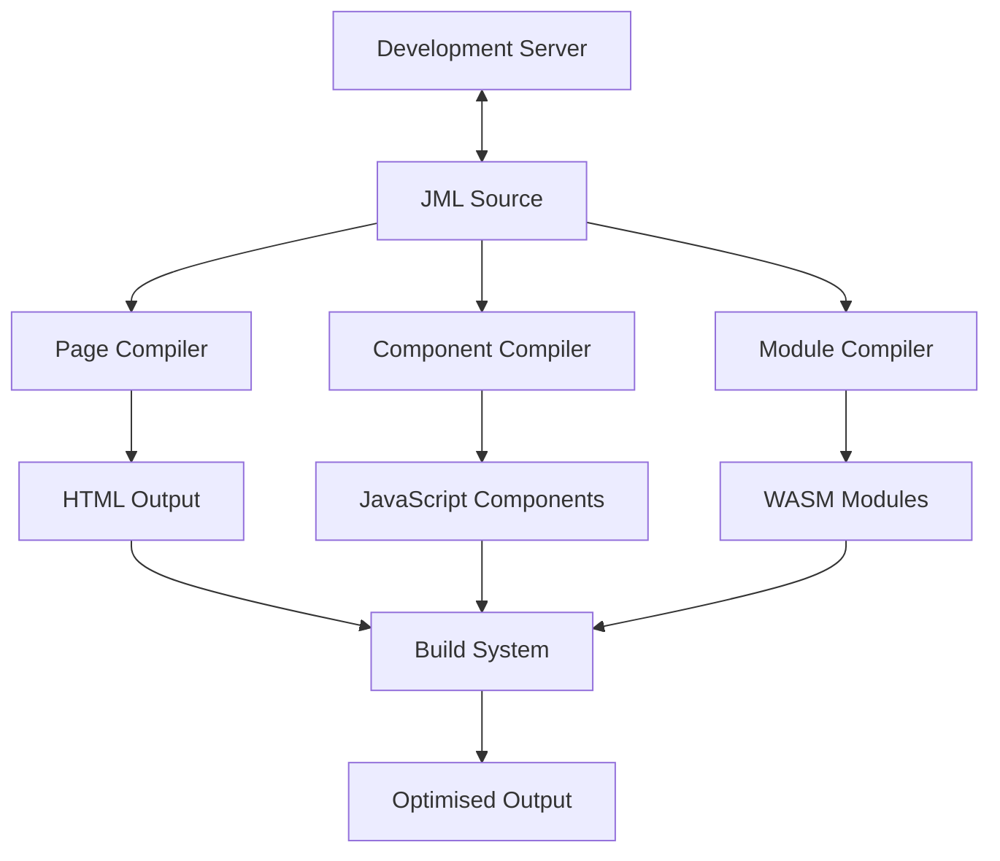

# JAWT Architecture Overview

This document provides a high-level overview of JAWT's architecture and its core components.

## Core Principles

1. **Declarative UI**: Uses JML for defining UI components and pages
2. **Component-Based Architecture**: Promotes reusability and composition
3. **Build-Time Optimisation**: Optimises assets during build time for production
4. **Developer Experience**: Provides hot reloading and sensible defaults

## High-Level Architecture

## Build Process

1. **Initialisation**: Load configuration and resolve dependencies
2. **Compilation**:
   - Parse JML files
   - Compile pages to HTML
   - Process components to JavaScript
   - Compile modules to WebAssembly
3. **Optimization**:
   - Minify assets
   - Tree-shake unused code
   - Optimise images and other assets
4. **Bundling**: Combine and optimise all assets for production

## Development Workflow

1. Run `jawt run` to start the development server
2. Make changes to JML files
3. Changes are automatically detected and compiled
4. Browser updates in real-time with hot module replacement
