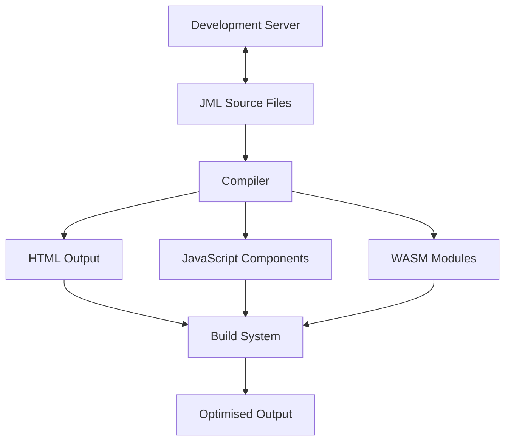

# JAWT Architecture Overview

This document provides a high-level overview of JAWT's architecture and its core components, including the new compilation system that streamlines the development process.

## Core Principles

1. **Declarative UI**: Uses JML for defining UI components and pages with clear, readable syntax
2. **Component-Based Architecture**: Promotes reusability and composition through well-defined component interfaces
3. **Compilation**: Single compiler handles all document types whilst maintaining specialised output generation
4. **Build-Time Optimisation**: Optimises assets during build time for production performance
5. **Developer Experience**: Provides hot reloading, consistent error reporting, and sensible defaults

## High-Level Architecture



The compiler acts like a sophisticated sorting and processing centre—it receives all JML files regardless of type, understands what each one needs to become, and routes them through the appropriate compilation pipeline whilst maintaining consistency and enabling cross-document optimisations.

## Compilation Process

The w architecture consolidates what were previously three separate compilers into a single, intelligent system:

### Document Type Processing
1. **Single Entry Point**: All `.jml` files enter through the compiler
2. **Document Type Detection**: Compiler identifies `_doctype` declarations (page, component, module)
3. **Specialised Processing**: Each document type follows its optimised compilation path
4. **Cross-Document Resolution**: Dependencies resolved across all document types simultaneously

### Compilation Phases
1. **Project Discovery**: Scan and categorise all JML files
2. **Parsing**: Parse all files using shared lexer and parser
3. **Symbol Resolution**: Build symbol table across all document types
4. **Semantic Analysis**: Validate types, imports, and dependencies project-wide
5. **Code Generation**: Route to specialised generators (HTML, JavaScript, WebAssembly)
6. **Optimisation**: Apply cross-document optimisations and bundling

## Build Process

1. **Initialisation**: Load configuration and discover all source files
2. **Dependency Analysis**: Build a complete dependency graph across all document types
3. **Compilation**:
   - Parse all JML files using shared infrastructure
   - Resolve symbols and validate cross-document references
   - Generate appropriate output for each document type:
      - Pages → HTML with embedded component references
      - Components → JavaScript web components
      - Modules → WebAssembly with JavaScript bindings
4. **Optimisation**:
   - Cross-document dead code elimination
   - Tree-shake unused components and modules
   - Minify and compress all assets
   - Optimise images and other resources
5. **Bundling**: Combine and optimise all assets for production deployment

## Development Workflow

1. Run `jawt run` to start the development server
2. Compiler processes all source files on startup
3. File watcher detects changes to any JML file
4. Incremental recompilation of affected files and dependents
5. Browser updates in real-time with hot module replacement
6. Consistent error reporting across all document types

## Key Architectural Benefits

### Before: Multiple Compilers
- Separate page, component, and module compilers
- Inconsistent error handling and reporting
- Complex inter-compiler dependency management
- Duplicated parsing and validation logic

### After: Unified Compiler
- Single compilation pipeline with specialised output paths
- Consistent error messages and development experience
- Optimised cross-document dependency resolution
- Shared parsing infrastructure reduces compilation time
- Easier maintenance and feature development

## Component Interaction

### Pages and Components
Pages import and embed components, creating a hierarchical structure that compiles to complete HTML documents with integrated JavaScript functionality.

### Components and Modules
Components can call WebAssembly modules for performance-critical operations, with the compiler automatically generating the necessary JavaScript-to-WASM bindings.

### Cross-Document Optimisation
The compiler can optimise across document boundaries, inlining small components, eliminating unused code, and optimising module call patterns.

## Performance Characteristics

### Compilation Performance
- **Parallel Processing**: Independent files compiled concurrently
- **Incremental Updates**: Only recompile changed files and dependents
- **Shared Infrastructure**: Common parsing and analysis reduce overhead
- **Cached Results**: ASTs and symbol tables cached between builds

### Runtime Performance
- **Optimised Output**: Cross-document optimisations improve runtime performance
- **Minimal Overhead**: Generated code has minimal framework overhead
- **Efficient Loading**: Components and modules loaded on-demand
- **WebAssembly Integration**: Performance-critical code runs at near-native speed

## Configuration Integration

The compiler integrates with project configuration through `jawt.config.json`:

```json
{
  "compiler": {
    "target": "es2020",
    "optimization": "production",
    "sourceMap": true
  },
  "build": {
    "outDir": "dist", 
    "minify": true
  },
  "development": {
    "hotReload": true,
    "errorOverlay": true
  }
}
```

